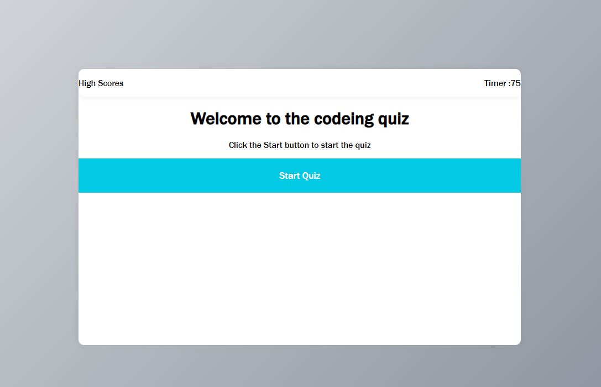
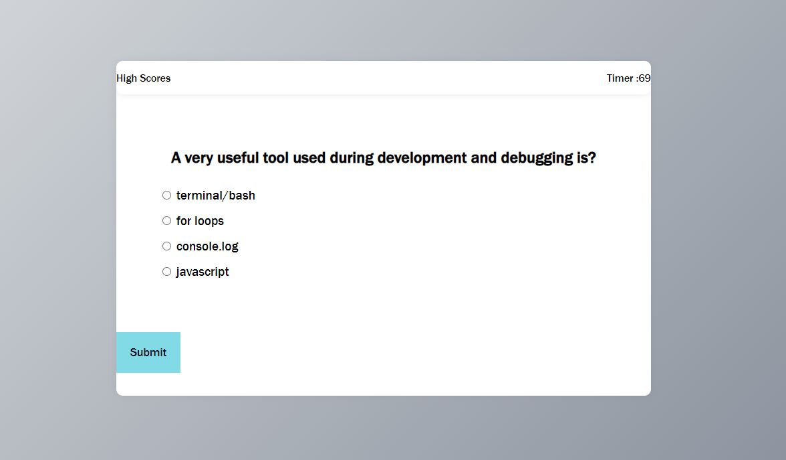
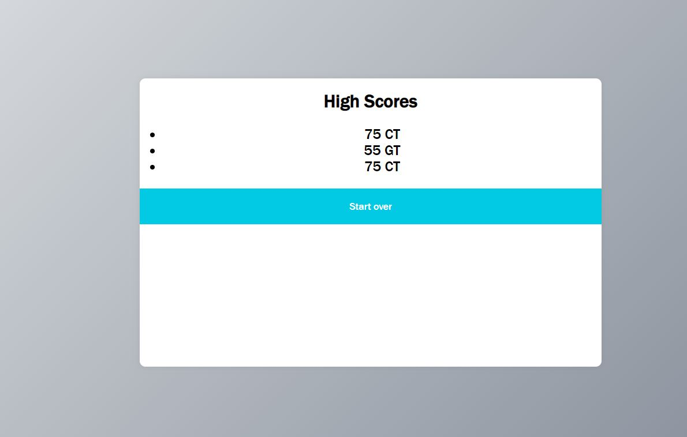

# Quizzy

### a short coding quiz game
When you start the quiz the timer starts counting down from 75 seconds and a question is presented to be answered. If you answer all questions correctly in less than 75 seconds you win and your score will be displayed. If you answer a question incorrectly 10 seconds will be taken off the timer. After the quiz is over you can see the high scores.

## Screenshot

## Github repository

https://github.com/ctowns5/quizzy

## The URL of the deployed application

https://ctowns5.github.io/placeholder/